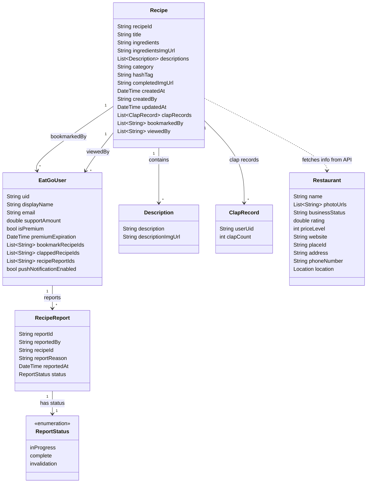

# 🍀 Eat-Go! 🍀

  

  복잡하게 고민하지 말고 흔들어 보세요, 
  뜻밖의 맛있는 행운이 찾아올 거예요. 
   
  우연한 발견의 즐거움! 
   
  뭐 먹을지 모르겠어서 고민만하다가, 밥 제때 안챙겨먹고 건너뛰는 사람들! 
   
  이제 먹으러 갑시다-! 

## 📸 스크린샷

## 스토어
 출시완료
 
 심사중

## 🎬 데모 영상

[Watch the video](https://www.youtube.com/watch?v=J6zWyVfZNvc)

## 소개
가위바위보 하듯이 휴대폰을 흔들면 랜덤으로 메뉴 추천을 해드립니다! 
마음에 든다면 레시피를 보고 새로운 요리에 도전해보세요~ 
뿐만아니라 관련 식당을 연결해드립니다! 
 

## ✨주요 기능
  + 랜덤 메뉴 추천
  + 북마크 기능
  + 식당 찾아주기 기능
  + 메뉴 필터 기능(재료로 검색)
  + 사용자 레시피 업로드 및 공유
<!--  + 레시피 공유하기 -->
<!--  + 자주먹는 top3 빈도수 체크 -->

 

## 🔧 기술스택:
- **Frontend**: Flutter
- **Backend**: Firebase (Firestore, Authentication, Storage)
- **API 연동**: Google Places API, Google Maps API
- **상태 관리**: Riverpod
- **아키텍처 패턴**: MVVM
- **라우터**: GoRouter

 

### 팀원 및 역할
- **기획**: 강수경
- **디자인**: 강수경
- **개발**: 강수경
- **배포**: 강수경

 

## Eat-Go! – App Store 음식 및 음료 카테고리 TOP 10 달성 🎉

 

## Class Diagram

<h3>데이터 컬렉션</h3>

`users` 컬렉션
사용자 정보를 저장하는 컬렉션입니다. 각 사용자별 북마크, 박수, 신고 내역, 프리미엄 상태 등의 정보가 포함됩니다.
 

`recipes` 컬렉션
레시피 정보를 저장하는 컬렉션입니다. 각 레시피에 대해 조회 및 북마크한 사용자 목록과 박수(클랩) 기록, 레시피 설명 등의 정보를 저장합니다.
또한 Google Places API를 통해 레시피 제목(`title`)을 기반으로 연관된 음식점(`Restaurant`) 정보를 동적으로 가져올 수 있습니다.
 

`recipeReports` 컬렉션
레시피 게시물에 대한 신고 기록을 저장하는 컬렉션입니다. 사용자가 신고한 레시피와 신고 이유, 상태 등을 포함합니다.
 
 

<h3>클래스 구조</h3>
<h4>EatGoUser (User)</h4>
사용자의 정보와 관련된 기능을 정의하는 클래스입니다.

`uid`: 사용자 고유 ID
 
`displayName`: 사용자 표시 이름 (null일 경우 이메일 ID 사용)
 
`email`: 사용자 이메일 주소
 
`supportAmount`: 후원 금액
 
`isPremium`: 프리미엄 구독 상태
 
`premiumExpiration`: 프리미엄 만료일
 
`bookmarkRecipeIds`: 사용자가 북마크한 레시피 ID 목록
 
`clappedRecipeIds`: 사용자가 박수를 친 레시피 ID 목록
 
`recipeReportIds`: 사용자가 신고한 레시피 ID 목록
 
`pushNotificationEnabled`: 푸시 알림 설정 상태
 
 

<h4>Recipe</h4>
레시피의 주요 정보와 사용자 상호작용 정보를 저장하는 클래스입니다.

`recipeId`: 레시피 고유 ID
 
`title`: 레시피 제목
 
`ingredients`: 필요한 재료 목록
 
`ingredientsImgUrl`: 재료 이미지 URL
 
`descriptions`: 레시피 단계별 설명 (`Description` 클래스의 리스트로 구성)
 
`category`: 레시피 카테고리
 
`hashTag`: 레시피와 관련된 해시태그
 
`completedImgUrl`: 완성된 레시피 이미지 URL
 
`createdAt`: 레시피 생성 날짜
 
`createdBy`: 작성자 ID (사용자 ID 또는 시스템 ID)
 
`updatedAt`: 마지막 업데이트 날짜
 
`clapRecords`: 사용자별 박수 기록 (`ClapRecord` 클래스의 리스트로 구성)
 
`bookmarkedBy`: 레시피를 북마크한 사용자 UID 목록
 
`viewedBy`: 레시피를 조회한 사용자 UID 목록
  
*참고*: `Recipe` 클래스는 `title`과 `hashTag`를 Google Places API의 쿼리로 사용하여 관련 음식점(`Restaurant`) 정보를 동적으로 가져옵니다.
  

<h4>Description</h4>
레시피 단계별 설명을 관리하는 클래스입니다.

`description`: 단계별 설명 문단
 
`descriptionImgUrl`: 단계별 설명에 대한 이미지 URL
  

<h4>ClapRecord</h4>
특정 사용자가 레시피에 누른 박수 기록을 관리하는 클래스입니다.

`userUid`: 박수를 누른 사용자 ID
 
`clapCount`: 해당 사용자가 누른 총 박수 수
  

<h4>RecipeReport</h4>
레시피 신고에 대한 정보를 관리하는 클래스입니다.

`reportId`: 신고 기록 고유 ID
 
`reportedBy`: 신고한 사용자 ID
 
`recipeId`: 신고된 레시피 ID
 
`reportReason`: 신고 사유
 
`reportedAt`: 신고 일시
 
`status`: 신고 처리 상태 (`inProgress`, `complete`, `invalidation`)
  

<h4>ReportStatus (enum)</h4>
신고 처리 상태를 정의하는 열거형입니다.

`inProgress`: 신고 처리 중
 
`complete`: 신고 처리 완료
 
`invalidation`: 신고 무효화
  

<h4>Restaurant</h4>
Google Places API를 통해 가져온 음식점 정보를 저장하는 클래스입니다.

`name`: 음식점 이름
 
`photoUrls`: 음식점 이미지 URL 리스트
 
`businessStatus`: 운영 상태 (예: `OPERATIONAL`)
 
`rating`: 음식점 평점
 
`priceLevel`: 가격대 (0 - 무료, 4 - 매우 비쌈)
 
`website`: 음식점 웹사이트 URL
 
`placeId`: 음식점 고유 ID
 
`address`: 위치 주소
 
`phoneNumber`:  전화번호
 
`location`: 위도와 경도를 포함한 위치

## 프로젝트를 하면서 가장 어려웠던 상황은?
인증과 관련된 기능에서 상태 관리와 타이밍 이슈가 가장 어려웠습니다. 특히, 사용자가 탈퇴 후 재가입 시 현재 User 데이터가 갱신되지 않는 문제가 있었습니다.
 

이는 DB에 데이터가 저장되기 전에 인증이 완료되어 홈 화면으로 리다이렉트가 이루어졌고, 이로 인해 화면 갱신이 먼저 이뤄지면서 데이터베이스에서 null 값을 읽어오는 상황이었습니다.
 

이 문제를 해결하기 위해, 명시적으로 상태를 갱신하는 메서드(`signInViewModel.signInWithGoogle()`)를 작성하고 호출하여 화면에서 올바른 데이터를 반영할 수 있도록 수정하였습니다. 이를 통해 인증과 상태 관리 간의 타이밍 문제를 효과적으로 해결할 수 있었습니다.
 
[0bd64c](https://github.com/kangsudal/Eat-Go/commit/0bd64c057eb0cfcb9a8ba0135d71211bb095d869#diff-1d3db75ec69a30fc42b472889b887cf588d72b497023136dbbda4512bb6bc388R74)
[da4e25](https://github.com/kangsudal/Eat-Go/commit/da4e25e7e5bdaeb61b667d96a6aab343eaa4762c#diff-aa62413470e4747ba0805ff442318cc50230b9f0931037164a35e871cf55bc44R64)

## 코드 실행 방법
추가예정

## 📂 기획서
[Figma](https://www.figma.com/design/9dihzD5642Y9pduTTPtJ1R/Eat-Go!?node-id=17-250&t=H6rdwSURuCKQ0Gui-1)

[Google Slide](https://medium.com/@kangsudal/eat-go-%EA%B8%B0%ED%9A%8D%EC%84%9C-%EB%B0%9C%ED%91%9C-e0aedb679e3d)

## 📫 연락처
kangsudal@gmail.com
