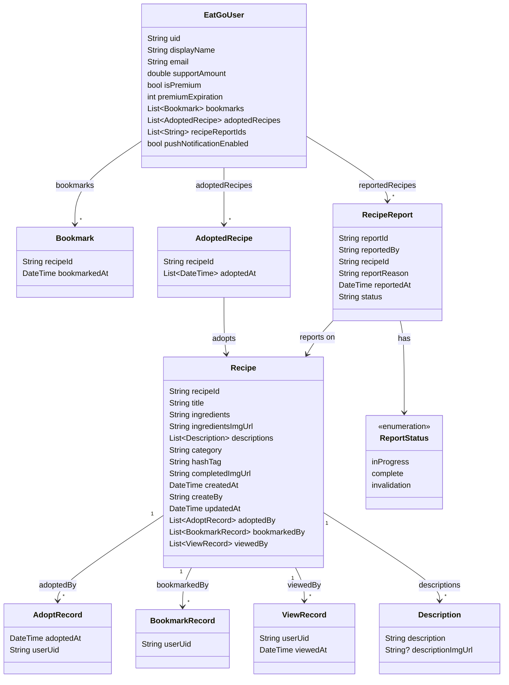

# 🍀 Eat-Go! 🍀

  

  복잡하게 고민하지 말고 흔들어 보세요, 
  뜻밖의 맛있는 행운이 찾아올 거예요. 
   
  우연한 발견의 즐거움! 
   
  뭐 먹을지 모르겠어서 고민만하다가, 밥 제때 안챙겨먹고 건너뛰는 사람들! 
   
  이제 먹으러 갑시다-! 

## 소개
가위바위보 하듯이 휴대폰을 흔들면 랜덤으로 메뉴 추천을 해드립니다! 
마음에 든다면 레시피를 보고 새로운 요리에 도전해보세요~ 
또 내가 제일 자주 먹는 음식이 뭔지 기록해보세요! 

 

**기능**
  + 랜덤 메뉴 추천
  + 레시피 공유하기
  + 북마크 기능
  + 자주먹는 top3 빈도수 체크
  + 식당 찾아주기 기능
  + 메뉴 필터 기능(재료로 검색)

 

**프레임워크**: Flutter

 

## 스토어
1. [플레이스토어](https://)
2. [앱스토어](https://)

 

## 사용 데이터 및 API
1. 조리식품 레시피 DB
2. Google map
   * 구글 맵 띄워주기
   * Places API(텍스트 검색)을 이용해 가게 찾기
3. OpenAI
   * 레시피명 보편화하여 추천하기
4. Firebase
   * Firebase Authentication: 구글 계정 가입,로그인
   * Cloud Firestore: 저장된 데이터 검색
   * Cloud Storage: 이미지 파일 저장

 

## Class Diagram

**users 컬렉션** : 사용자의 정보를 저장합니다.

**recipes 컬렉션** : 레시피의 정보를 저장하며, 누가 이 레시피를 조회하고 북마크하고 채택 했는지에 대한 정보(북마크한 전체 사용자 수, 조회수, 채택 횟수 계산을 위해)를 포함합니다.

**recipeReports 컬렉션**: 레시피 게시물 신고

----------------

**EatGoUser**
 - Bookmark : 사용자가 북마크한 레시피
 - AdoptedRecipe : 사용자가 그날 그날 채택한 레시피
 - (RecipeReport) : 사용자가 신고한 레시피

**Recipe**
 - Description : 레시피 설명 1줄&이미지
 - AdoptRecord : 모든 사용자 대상으로 채택 기록(누가 언제 어떤 레시피를 채택했는지)
 - BookmarkRecord : 모든 사용자 대상으로 북마크 기록(누가 어떤 레시피를 채택했는지)
 - ViewRecord : 모든 사용자 대상으로 조회 기록(누가 언제 어떤 레시피를 조회했는지)

**RecipeReport**
 

## 코드 실행 방법
추가예정

## 기획서
[Figma](https://www.figma.com/design/9dihzD5642Y9pduTTPtJ1R/Eat-Go!?node-id=17-250&t=H6rdwSURuCKQ0Gui-1)

[Google Slide](https://medium.com/@kangsudal/eat-go-%EA%B8%B0%ED%9A%8D%EC%84%9C-%EB%B0%9C%ED%91%9C-e0aedb679e3d)

## 연락처
kangsudal@gmail.com
