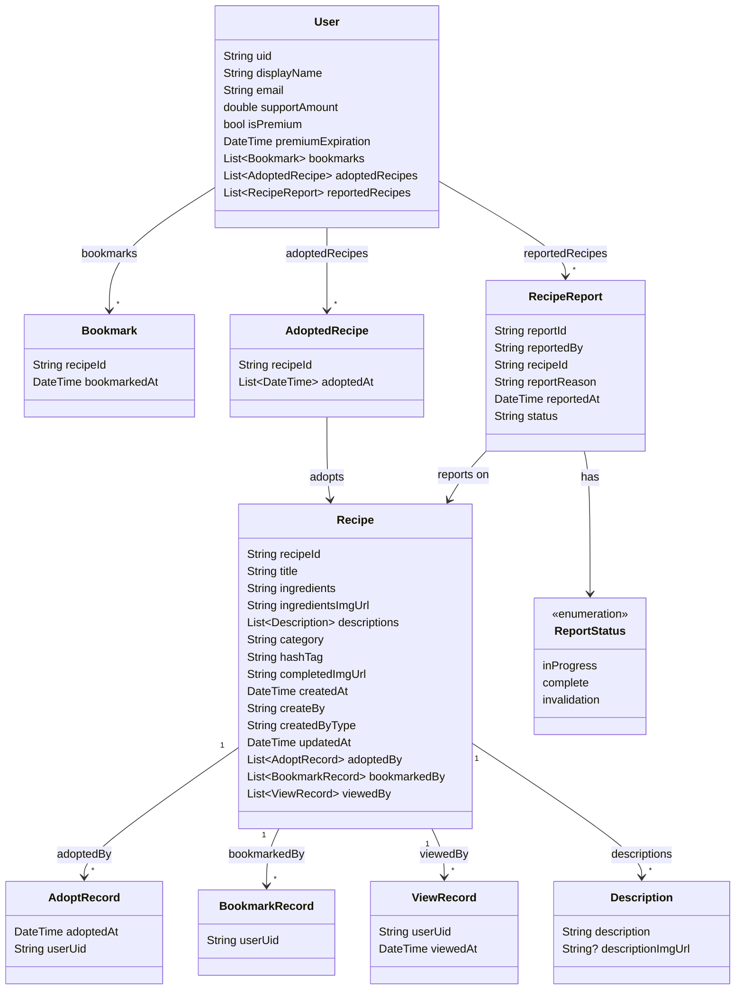

```mermaid
classDiagram
    class AdoptRecord {
        DateTime adoptedAt
        String userUid
    }

    class AdoptedRecipe {
        String recipeId
        List~DateTime~ adoptedAt
    }

    class Bookmark {
        String recipeId
        DateTime bookmarkedAt
    }

    class BookmarkRecord {
        String userUid
    }

    class Description {
        String description
        String? descriptionImgUrl
    }

    class Recipe {
        String recipeId
        String title
        String ingredients
        String ingredientsImgUrl
        List~Description~ descriptions
        String category
        String hashTag
        String completedImgUrl
        DateTime createdAt
        String createBy
        String createdByType
        DateTime updatedAt
        List~AdoptRecord~ adoptedBy
        List~BookmarkRecord~ bookmarkedBy
        List~ViewRecord~ viewedBy
    }

    class RecipeReport {
        String reportId
        String reportedBy
        String recipeId
        String reportReason
        DateTime reportedAt
        String status
    }

    class User {
        String uid
        String displayName
        String email
        double supportAmount
        bool isPremium
        DateTime premiumExpiration
        List~Bookmark~ bookmarks
        List~AdoptedRecipe~ adoptedRecipes
        List~RecipeReport~ reportedRecipes
    }

    class ViewRecord {
        String userUid
        DateTime viewedAt
    }

    class ReportStatus {
        <<enumeration>>
        inProgress
        complete
        invalidation
    }

    Recipe "1" --> "*" AdoptRecord : adoptedBy
    Recipe "1" --> "*" BookmarkRecord : bookmarkedBy
    Recipe "1" --> "*" ViewRecord : viewedBy
    Recipe "1" --> "*" Description : descriptions
    RecipeReport --> Recipe : reports on
    RecipeReport --> ReportStatus : has
    User --> "*" Bookmark : bookmarks
    User --> "*" AdoptedRecipe : adoptedRecipes
    User --> "*" RecipeReport : reportedRecipes
    AdoptedRecipe --> Recipe : adopts

```